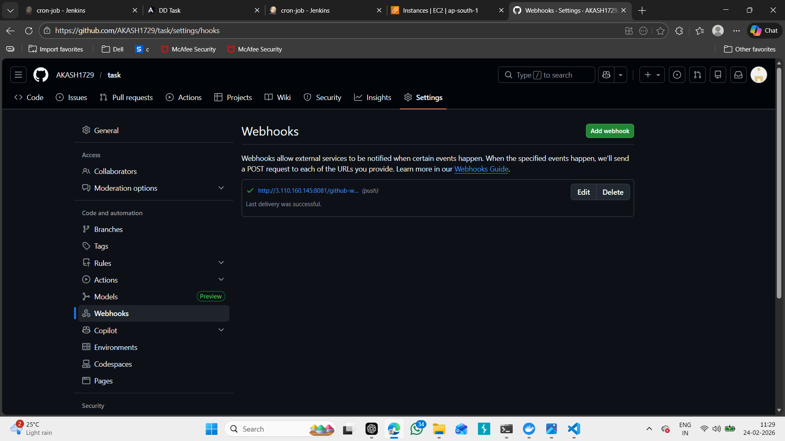
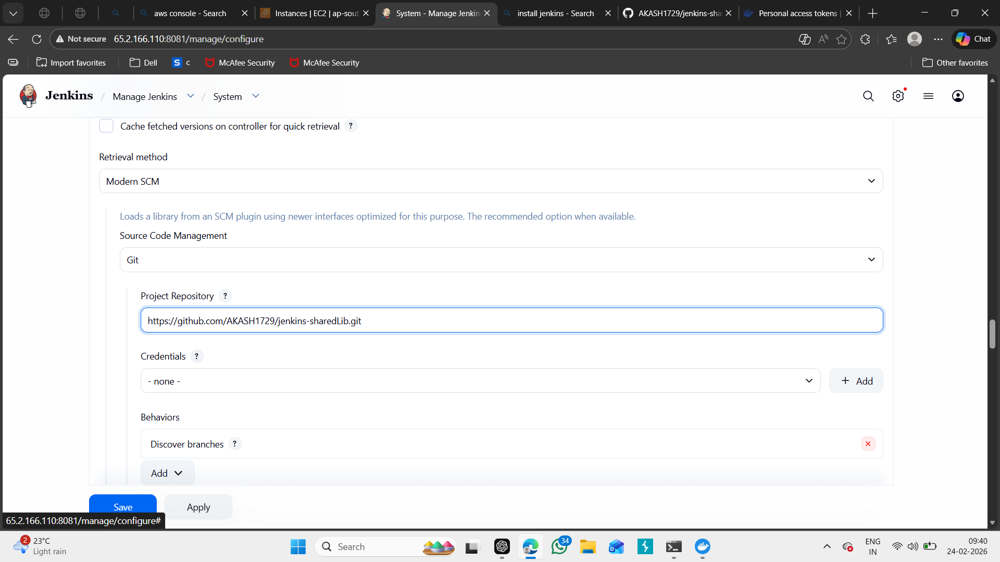
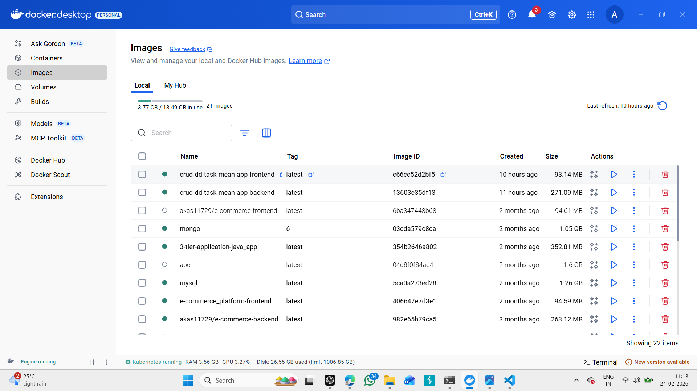
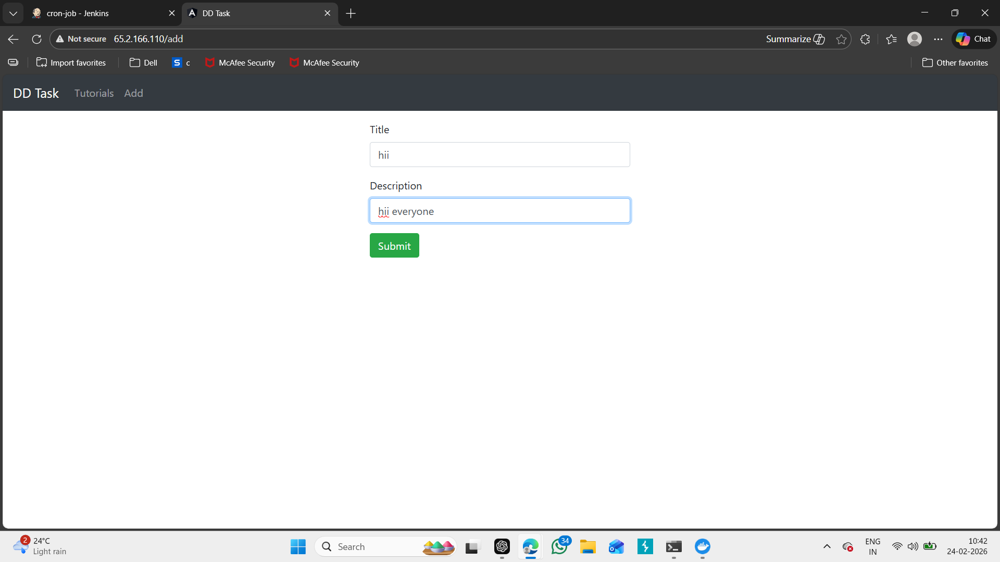

# 🚀 Full CI/CD Pipeline with Jenkins, Docker & Docker Compose

This project demonstrates a complete CI/CD pipeline using:

- ✅ GitHub Webhooks
- ✅ Jenkins Pipeline
- ✅ Docker & DockerHub
- ✅ Docker Compose Deployment
- ✅ AWS EC2 Hosting
- ✅ MongoDB + Backend + Frontend Application

---

# 🏗️ Architecture Overview

GitHub → Webhook → Jenkins → Build Docker Images → Push to DockerHub → Deploy using Docker Compose → Application Live on EC2

---

# 📂 Project Structure

---

# ⚙️ Step 1: GitHub Webhook Configuration

Webhook triggers Jenkins pipeline automatically on code push.

📸 Screenshot:

(screenshots/6.png)(screenshots/8.png)

---

# ⚙️ Step 2: Jenkins Shared Library Configuration

Jenkins configured with shared library from GitHub.

📸 Screenshot:

---

# ⚙️ Step 3: Jenkins Pipeline Parameters

Pipeline configured with parameters:

- FRONTEND_DOCKER_TAG
- BACKEND_DOCKER_TAG

📸 Screenshot:

(screenshots/8.png)

---

# ⚙️ Step 4: Pipeline Stage View (Failed Build Example)

Initial pipeline failures during Docker login & push.

📸 Screenshot:

---

# ⚙️ Step 5: Docker Compose Configuration

`docker-compose.yml` defines:

- Backend (Port 8080)
- Frontend (Port 80)
- MongoDB (Port 27017)

---

# ⚙️ Step 6: Successful Pipeline Execution

Pipeline stages:

- Checkout SCM
- Validate Parameters
- Git Checkout
- Docker Build
- Docker Login
- Docker Push
- Deploy via Docker Compose

📸 Screenshot :

📸 Screenshot:

---

# 🐳 Docker Images Built

Images created and push to dockerhub:

- `akash1729/cron-backend`
- `akash1729/cron-frontend`

📸 Screenshot:

---

# 🚀 Docker Containers Running

Running containers:

- crud-backend (8080)
- crud-frontend (80)
- mongodb (27017)

📸 Screenshot:

---

# 🌐 Application Deployment

Application deployed and accessible via:

📸 Screenshot:

📸 Screenshot:

📸 Screenshot:

📸 Screenshot:

---

---

# 🔥 CI/CD Flow Summary

1. Developer pushes code to GitHub
2. GitHub Webhook triggers Jenkins
3. Jenkins builds Docker images
4. Images pushed to DockerHub
5. Docker Compose deploys containers
6. Application automatically updated on EC2

---

# 🧠 Key Learning Outcomes

- Automated CI/CD pipeline setup
- Secure DockerHub credential management
- Jenkins parameterized pipeline
- Docker Compose multi-container deployment
- Webhook-based auto deployment
- Real-world DevOps workflow on AWS EC2

---
